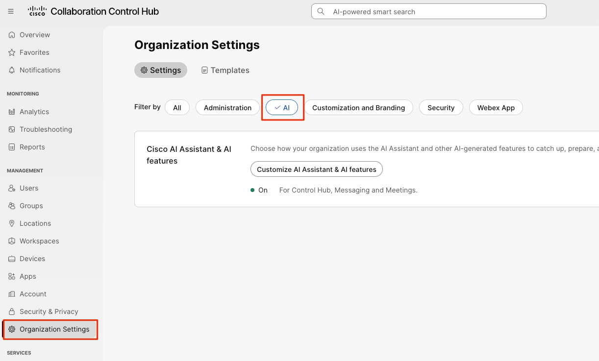
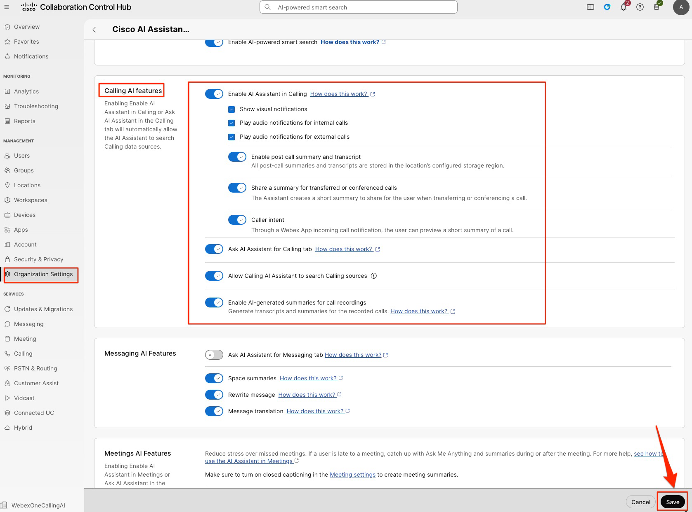
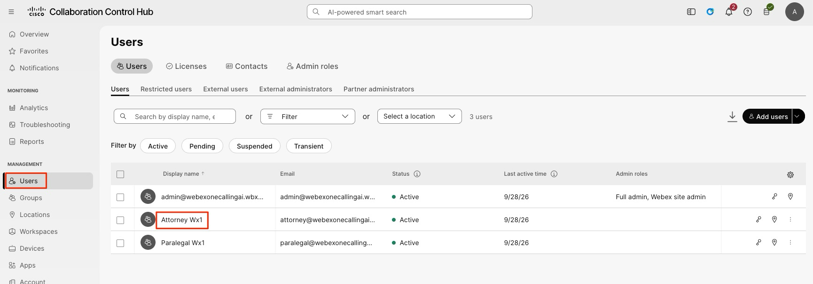
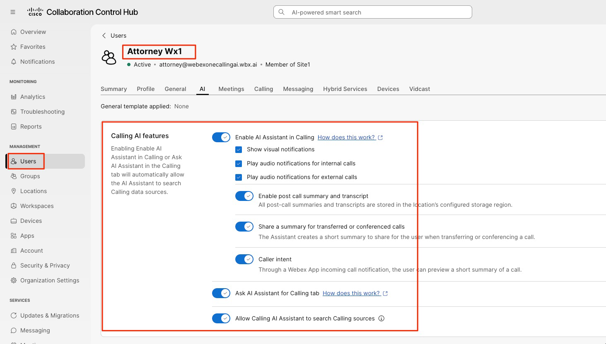
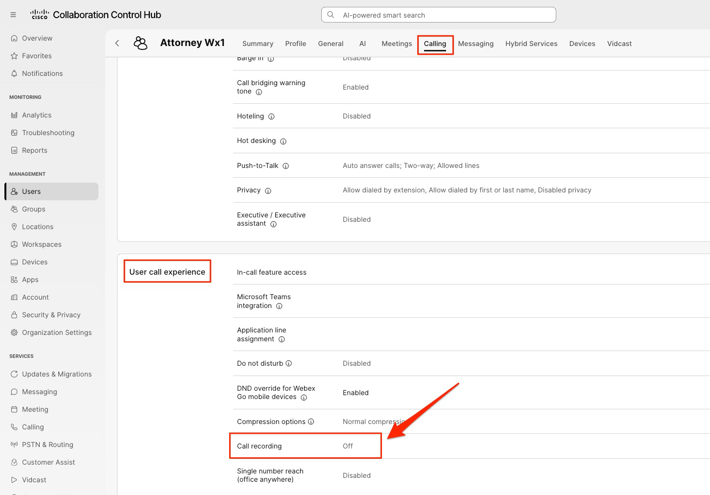
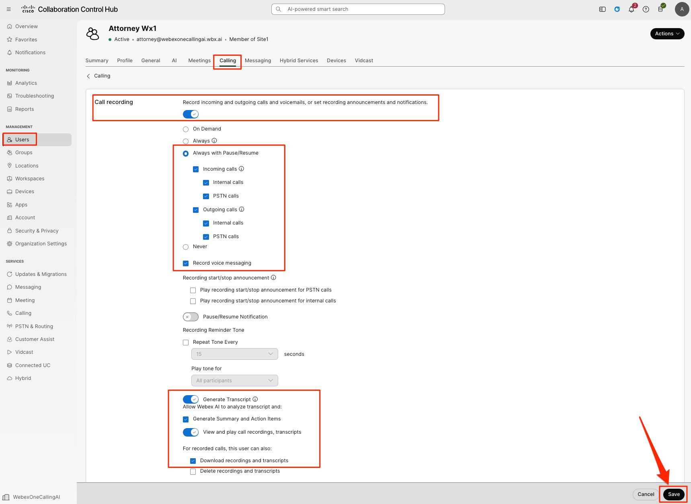

# Enabling AI features for Webex Calling

1. Navigate to “Organization Settings” in the left pane. In the “Filter by” section choose the option “AI”. This will help us to find the feature toggle that we are looking for. Feel free to browse through other options as needed.

    

2. Click “Customize AI Assistant & AI Features” and scroll down to the “Calling AI Features”

    

## Calling AI feature toggles

We are going to enable all the toggles here. A quick description about each of the toggle:

- Enable AI assistant in Calling—Make AI Assistant available in Webex calls for the organization.

- Show visual notifications— If turned on, users can see visual notifications.

- Play audio notifications for Internal calls—You can manage and control the audio and video notifications that are sent when AI Assistant is turned on for internal calls.

- Play audio notifications for External calls—You can manage and control the audio and video notifications that are sent when AI Assistant is turned on for external calls.

- Enable post call summaries and transcripts —If your users want to catch up on any call, the AI Assistant can help by summarizing the entire call from their call history. The post-call summary and transcript are stored in the storage region configured for their location.

- Share a summary for transferred or conference calls—If turned on, AI Assistant creates a short summary of the ongoing call so far, and shares it with the recipient on call transfer or conference.

- Caller intent—The Caller Intent feature provides a predictive summary of an incoming call, allowing users to understand the purpose of the call before answering. By leveraging action items from past interactions between the caller and the recipient, the system generates a concise preview. Upon answering, a comprehensive summary is automatically displayed within the AI Assistant panel for ongoing reference.

- Ask AI Assistant for Calling tab—Allow users to ask AI Assistant questions about the call, users, contacts, dates or any topic discussed in your current or previous calls and meetings.

- Allow Calling AI Assistant to search Calling sources—Allows the AI Assistant to search Calling summaries and transcripts.

- Enable AI generated summaries for call recordings—Generates the transcripts and summaries for recorded calls.

1. Enable all the toggles and click “Save”

    

2. Feel free to browse through and read the other Webex AI features for various other Webex workloads.

## Validate users and enable call recording

1. We are now going to validate the AI settings for the user accounts and also enable “Webex Call Recording” for the user accounts.

2. Navigate to “Users” under Management and click on the first user account “Attorney”

    

3. Click the “AI” tab and make sure all the toggles are showing as “Enabled”. If not, Enable them and click “Save”

    

4. Now click the “Calling” tab on the top and scroll down to the “Call Recording” option. Click the Call Recording option.

    

5. Enable the toggle for Recording. As soon as you enable the toggle, you will see a lot of options open up for Call Recording.

- Enable the toggle for “Always with Pause/Resume” – this will record all the calls with the option of Pause and Resume recording, so that the user can decide when to pause and resume the call recording.

- Enable the call recording for both the Incoming and Outgoing calls.

- Enable the option to record “Voice messaging”. Make sure the “Generate Transcript” option is enabled.

- Enable the option “View and play call recordings, transcripts” and the option of “Download recordings and transcripts.

Click “Save” on the bottom right corner of the screen.

1. Now repeat the above steps for our other user, Paralegal.

With those, both the user accounts are enabled for all the Webex Calling AI features and Webex Call Recording is enabled for both the user accounts.

When you do the same in your production environment, you can make use of Templates or API’s to apply these settings to users in a bulk fashion.

