# AI Receptionist

AI Receptionist for Webex Calling is your always-available virtual front desk assistant. It automates routine tasks like answering calls, responding to simple questions, and transferring calls to queue. With AI Receptionist handling the basics, your staff can stay focused on high-value conversations that truly enhance customer satisfaction.

We are going to create an AI Receptionist to front face the calls from our callers. In our lab scenario, our AI Receptionist will answer the call and will help our callers with responding to simple questions and based on the intent, our AI receptionist can transfer the call to the Paralegal or to the Attorney.

1. Navigate to “Calling” in the left pane and then click “AI Receptionist” on the list.

    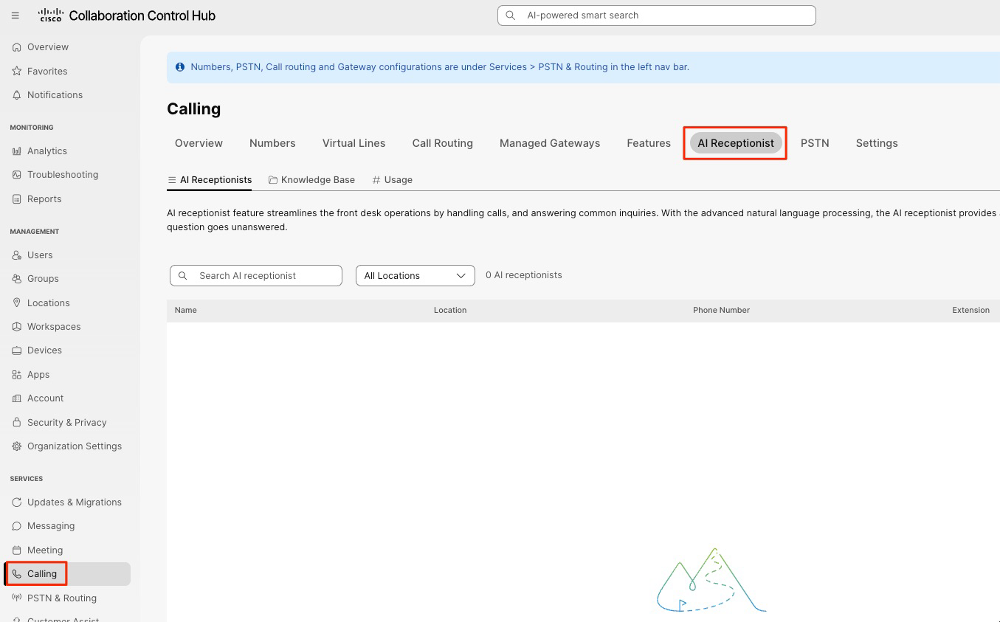

## Create the knowledge base

!!! note "Knowledge base PDF needed"

    The source guide refers to a downloadable law firm FAQ PDF, but provides no download link or attached PDF. Obtain the file from your lab instructor before continuing with the knowledge base upload.

1. First, lets upload a Knowledge base doc for our AI Receptionist. Click the link below and download the PDF file.

2. Click “Knowledge Base” and then click “Create knowledge base” option.

    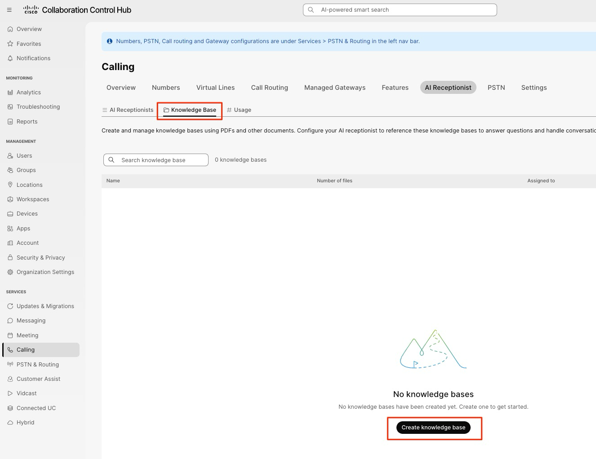

3. Give the knowledge base a name and description of your choice. Or you can give the name as “FAQs” and the description as “Law Firm FAQs”. Click Create.

    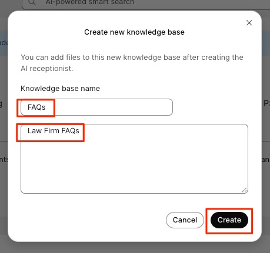

4. Now click the “FAQs” knowledge base.

    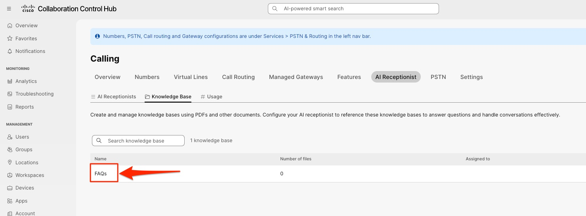

5. Click “Add”

    

6. In this next screen, click “Choose a file” and choose the file you downloaded from the first step in this section.

    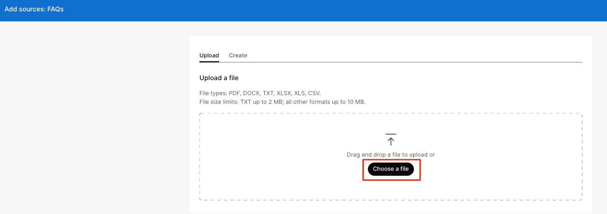

7. Then click “Add” after you have chosen the downloaded file.

    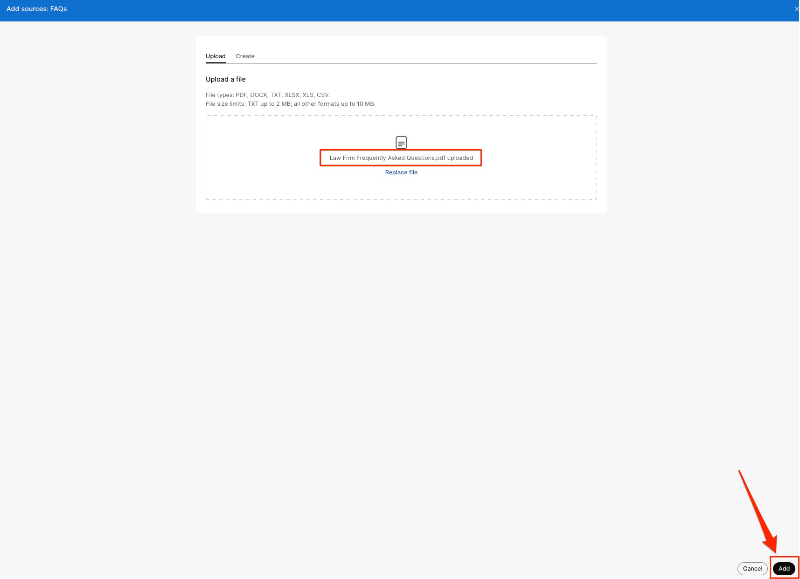

8. Now the file will take few mins to process. We can continue building the AI Receptionist. Click the Back button on the top, next to “Knowledge Base” wording

    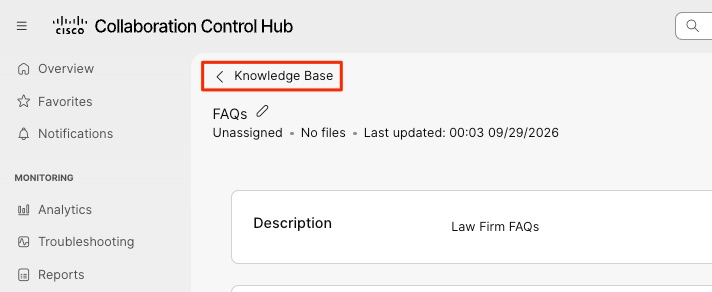

## Create the AI Receptionist

1. Click “AI Receptionists” on the top and click “Create AI receptionist”

    

2. You will now see the “AI Receptionist” wizard. There are multiple steps/tabs that will assist us in building the AI Receptionist.

3. For the General Settings tab, use the following values and click Next.

Location: Site1

AI Receptionist Name: Law Firm AI Receptionist

Phone number: {{Choose a number from the drop-down}}

AI Engine: Webex AI Pro US 1.0

AI Receptionist Language: English (United States)

AI Receptionist Voice: {{Any of your choice}}

Direct line caller ID Name: {{Choose the Display name}}

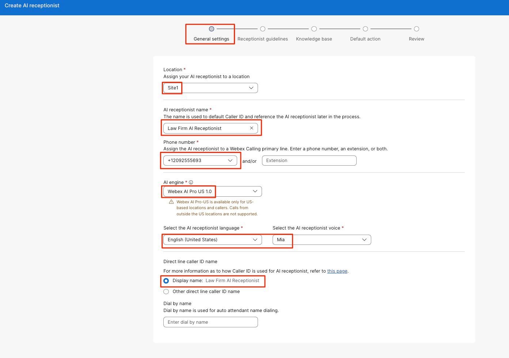

## Receptionist guidelines

1. In this page of “Receptionist guidelines” – we can setup the AI Receptionist Goal, the AI Transparency message and the Welcome message.

AI Receptionist Goal - we can instruct the AI Receptionist how to work or respond with the caller. All the guardrails and the instructions can be mentioned in this field – we can get as granular as we want and give it very specific instructions.

Transparency message – We can type in the message that the AI Receptionist must read out to the caller indicating the call is answered by an AI. You can alter the message if needed.

Welcome message – The Welcome message that is said by the AI Receptionist after the Transparency message is read out.

For our use-case today, we are going to use an existing Template. Click the “Apple template” drop-down and choose the option “Legal Firm”

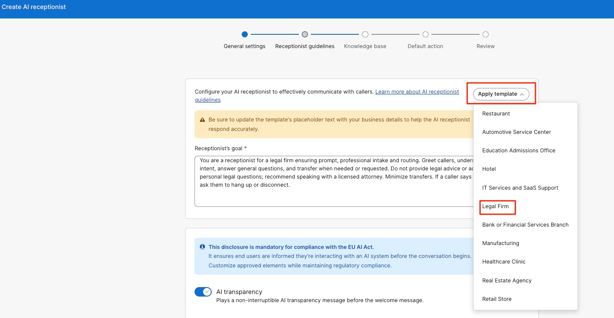

1. Take a minute to read the Template’s AI Receptionist Goal and the Welcome message. The Goal from the template is good for our lab today but if you would like to add more goals or instructions to the AI Receptionist – feel free to do so.

2. Welcome Message – The template will put in the tag “\[FirmName\] – \[City\]” – remove that and add the name as “Suit Yourself Law Firm”. Your Welcome Message can be: “Hello! Welcome to Suit Yourself Law Firm. How can I help you today?”. If you would like a different Welcome message – please change it to your choice.

3. Click “Next”

    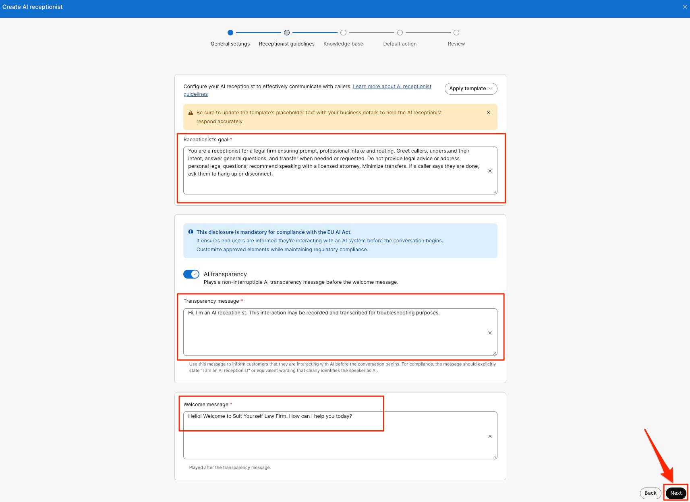

## Select the knowledge base

1. In this page, click the “Select” drop-down and choose the knowledge base that you had created. Click “Next” in the bottom right corner after choosing the knowledge base.

    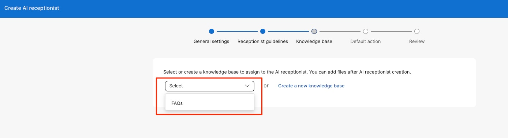

## Default action and review

1. In this page, we can choose the “Default action” for our AI Receptionist. After the caller question is answered/unanswered by the AI Receptionist by referencing the knowledge base and the caller still has a question – we can perform the default action.

2. Click the drop-down and choose the option “Transfer Call” and choose the Contact type as “User” and choose the “Paralegal” user here. Click “Review” on bottom right corner.

    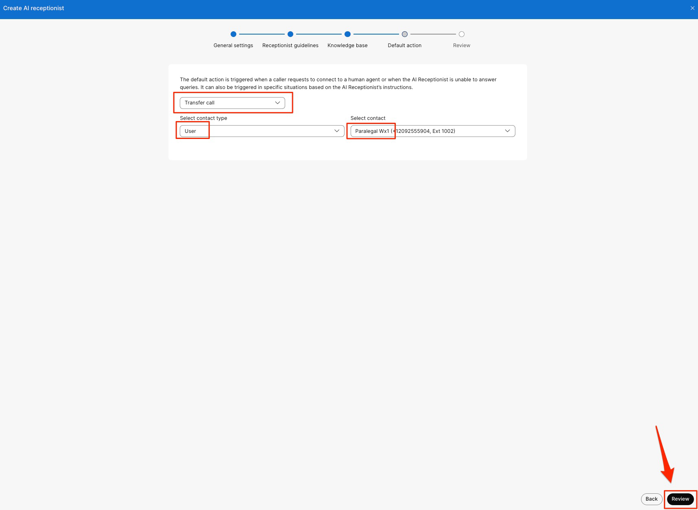

3. Review all the settings and if everything looks good, click “Create”.

    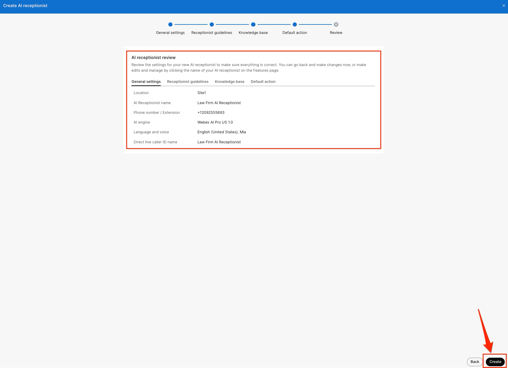

## Create routing intents

1. Now, lets create some Intents for our AI Receptionist. Click “Next:Add Intents” on bottom right corner.

    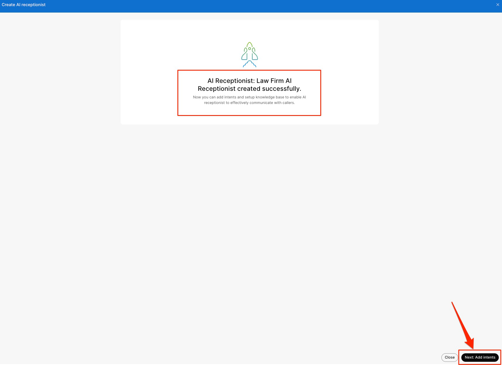

2. We will create two Intents here. One is if the caller wants to talk to the Paralegal and the other if the caller wants to talk to the Attorney.

## Intent 1 Paralegal

Intent Name: Paralegal

Intent description: Use this if the caller is asking to speak to a Paralegal. Also if the caller is requesting to talk to a human agent or an associate. If the caller is requesting any documentation update or any assistance with documents – use this intent.

Transfer to: User

Select Contact: Paralegal

Click “Add Intent”

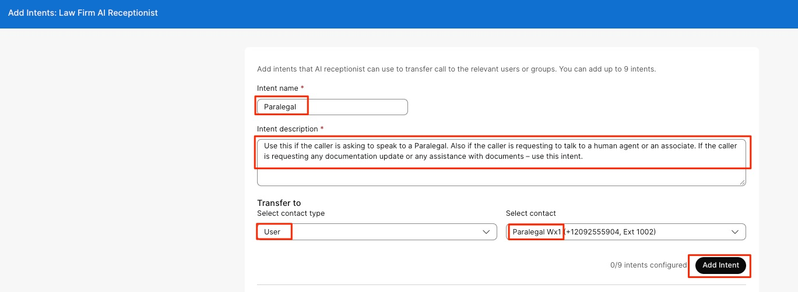

## Intent 2 Attorney

Intent Name: Attorney

Intent description: Use this if the caller is asking to speak to aa Attorney. If the caller is requesting any update about their case or if they need any details about their case. Also, if the caller is needing any information from the Court trial, use this intent.

Transfer to: User

Select Contact: Attorney

Click “Add Intent”

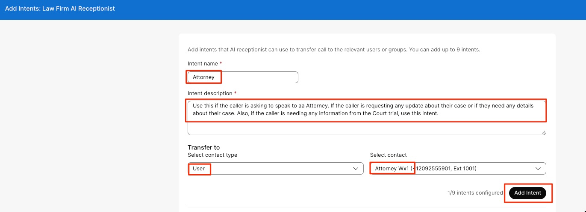

## Confirm the knowledge base

1. Now we have two intents created, lets move to the next step. Click “Next: Go to knowledge base” in the bottom right corner. Make sure, your knowledge base document is showing up in the files list.

    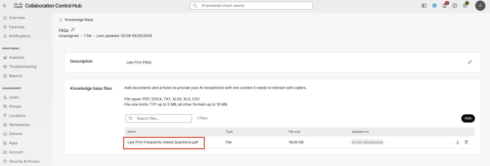

2. Now, we are ready for testing.

