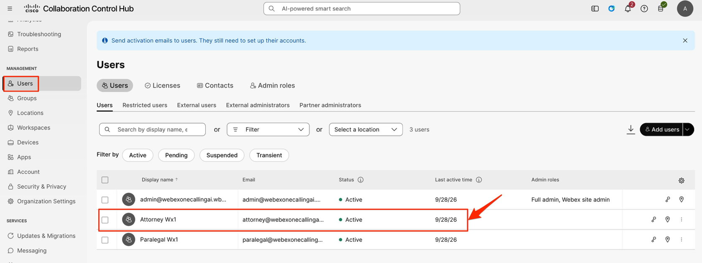
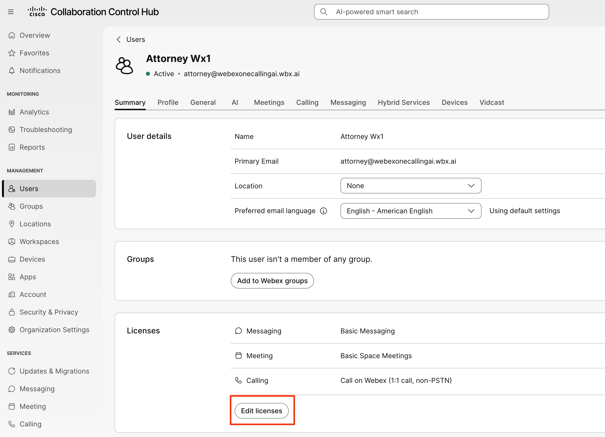
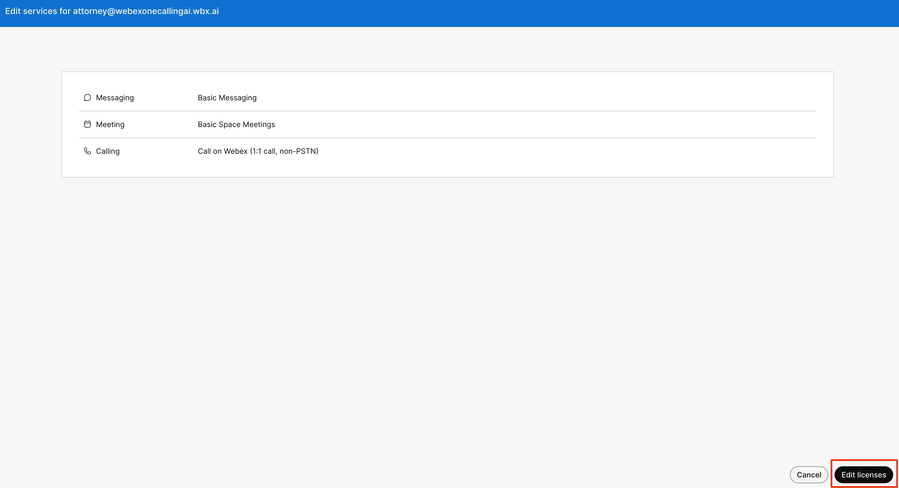
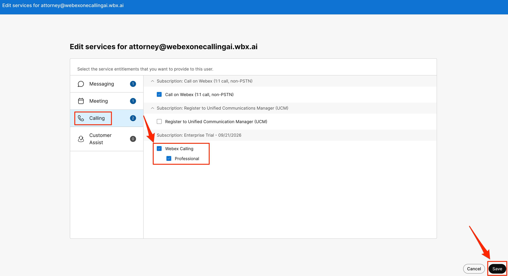
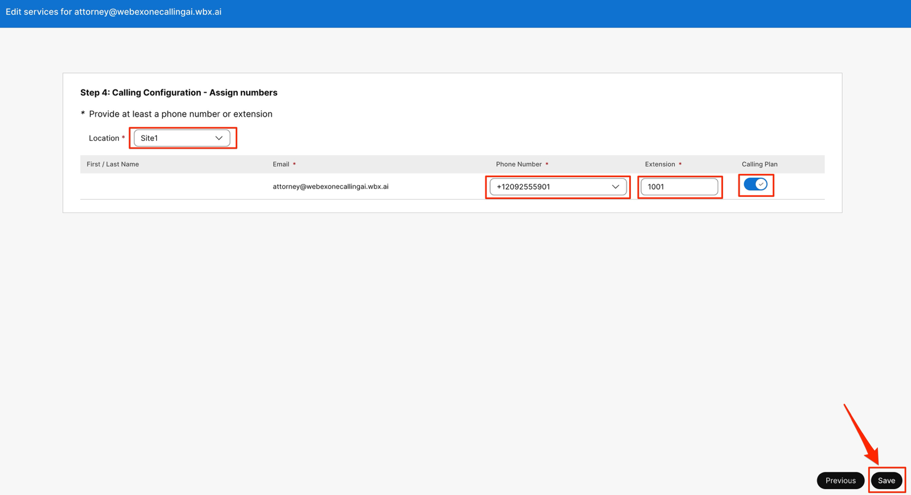
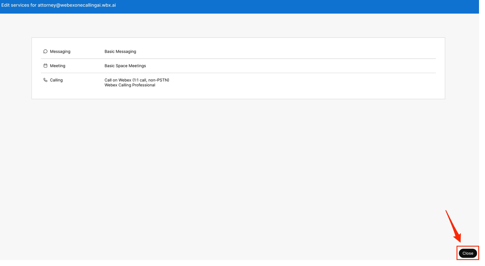
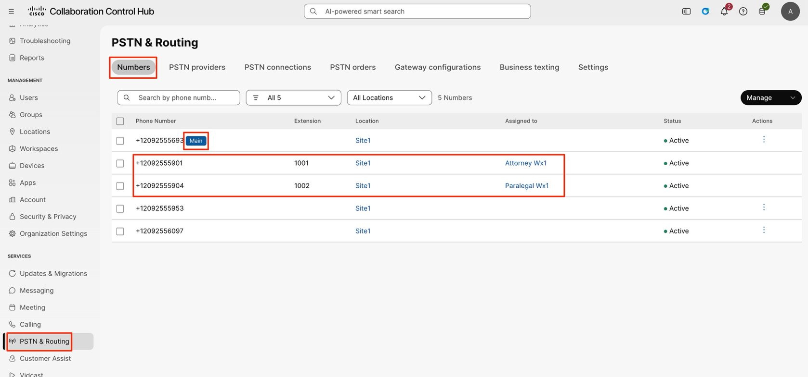

# Licensing users

We have two users in this lab 1. Attorney and 2. Paralegal. We will now license these users.

1. Navigate to Users and then click on “Attorney Wx1” user account.

    

2. Click “Edit licenses”

    

3. Click “Edit licenses” one more time on the bottom right corner.

    

4. Click “Calling” and then choose “Webex Calling”. You will see “Professional” enabled, this is expected. Click ‘Save’ on bottom right corner.

    

5. In this page, click the Location drop-down and choose Site1. And then click the ‘Phone number’ drop-down and choose any number other than the main number (anything other than the first number in the list) and then in the ‘Extension’ field enter the number 1001. Make sure ‘Calling plan’ toggle is enabled and then click ‘Save’ in bottom right corner.

    

6. Click ‘Close’

    

7. Repeat the above steps for the other user “Paralegal” but assign the extension as 1002.

8. Click “PSTN & Routing” and make sure you see the numbers assigned to the users Attorney and Paralegal. And one number tagged as Main number.

    

