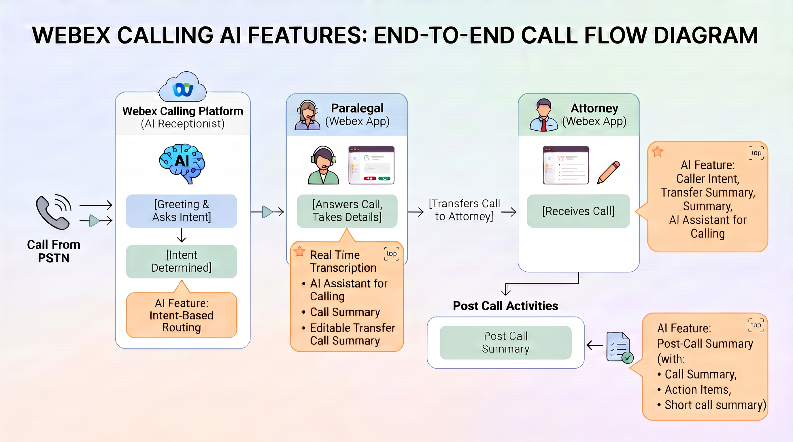

<!--
# 
Welcome!

<iframe src="https://app.sli.do/event/9FSNERWiqKg55MygtExCBX/questions" height="100%" width="100%" frameBorder="0" style="min-height: 560px;" allow="clipboard-write" title="Slido"></iframe>
-->

# Beyond the Ring: Unleashing Webex Calling AI for the Modern Enterprise

Alejandra Gonzalez Romero – Solutions Engineer

Bryan Waldmann – Leader, Solutions Engineer

Rajamani Nallakaruppan – Solutions Engineer

## About this lab

In this lab, you will learn how to setup the Webex Calling AI features. We start by laying down a common foundation that every deployment requires—configuring locations, setting organizational parameters, establishing PSTN connectivity, assigning phone numbers, and licensing users. These steps ensure that your environment is fully prepared for the next phase.

You will build a real-world industry use case end-to-end using AI Assistant for Calling (Call Summaries and Share-on-Transfer), Ask Me Anything, and the AI Receptionist. You will design, configure, and validate your solution with live test calls, seeing real-time summaries, intelligent call routing, and context-aware handoffs in action.

By the end of the lab, you will walk away with a working prototype, a deployment blueprint, and the skills to transform voice into your organization's smartest productivity asset.

## Lab modules

1. [Lab topology](lab-topology.md)
2. [Getting started and accessing the lab](getting-started.md)
3. [Location and basic calling setup](calling-setup.md)
4. [Licensing users](licensing-users.md)
5. [Enabling AI features for Webex Calling](ai-features.md)
6. [AI Receptionist](ai-receptionist.md)
7. [Verification of Webex AI Calling features](verification.md)
